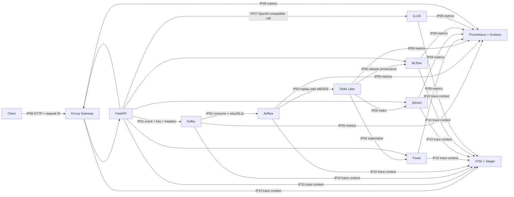

# Day 28 Track 2 — Modern AI Platform Integration Lab

> **Bắt đầu ở đây.** Repo này là bản dành cho học viên: platform đã có sẵn phần
> khung, còn 4 boundary quan trọng cần hoàn thiện. Làm theo README từ trên xuống,
> chạy checkpoint sau mỗi bước và chuẩn bị demo 10 integration points trước lớp.

## Bạn sẽ làm được gì?

Sau bài lab, nhóm có thể:

1. truyền W3C trace context và idempotency key qua Kafka;
2. làm cho Delta MERGE an toàn khi Kafka replay;
3. giữ đúng contract giữa serving API và Feast online store;
4. phân biệt `ready`, `degraded` và `not_ready`;
5. chạy, quan sát và giải thích một AI platform gồm Kafka, Airflow, Spark/Delta,
   Feast, Qdrant, MLflow, vLLM, Envoy và OpenTelemetry;
6. demo happy path, một sự cố có recovery và một lần rollback có bằng chứng.

Không cần hoàn thành mọi phần trên một laptop. Mọi học viên đều làm được code và
test trên Windows/macOS/Linux; full stack có thể chạy trên máy nhóm, browser
workspace hoặc máy facilitator; GPU có thể dùng Kaggle/endpoint dùng chung.

## Kiến trúc và 10 integration points



Contract chấm điểm nằm ở
[`contracts/integration-matrix.yaml`](contracts/integration-matrix.yaml). Mô tả
đầy đủ của bài toán nằm ở [`LAB28.md`](LAB28.md); rubric nằm ở
[`docs/rubric.md`](docs/rubric.md).

## Chọn đường chạy phù hợp với máy

| Đường chạy | Bạn cần | Làm được gì | Phù hợp |
|---|---|---|---|
| **Code-only** | 4 GB RAM, khoảng 3 GB trống | 4 TODO, fast tests, contracts, K8s/GitOps static checks | Mọi học viên |
| **Core Compose** | Khuyến nghị 8 GB RAM, 4 CPU, 12 GB trống | Kafka, API, gateway, Feast, Qdrant, MLflow, metrics và traces | Laptop trung bình |
| **Full Compose** | Khuyến nghị 12–16 GB RAM, 6 CPU, 20 GB trống | Thêm Spark Connect và Airflow; chạy 5 live journeys | Máy nhóm/facilitator |
| **GPU extension** | NVIDIA phù hợp hoặc Kaggle T4/endpoint thật | Thay degraded LLM bằng vLLM thật | Optional/shared |

Nếu `preflight` chọn `browser-fallback`, bạn **không bị giảm learning outcome**:
làm Step 1–6 trên máy mình, sau đó ghép vào full stack dùng chung để chạy Step
7–9. Kaggle chỉ giải quyết IP07/vLLM; nó không thay Kafka, Delta, Feast hay
observability. Xem [`KAGGLE_GPU_EXTENSION.md`](KAGGLE_GPU_EXTENSION.md).

## Trước khi bắt đầu

Cài ba công cụ:

- Git;
- `uv` theo [hướng dẫn chính thức](https://docs.astral.sh/uv/getting-started/installation/);
- Docker Desktop trên Windows/macOS, hoặc Docker Engine + Compose plugin trên
  Linux, theo [hướng dẫn chính thức](https://docs.docker.com/engine/install/).

Kiểm tra ở PowerShell, Terminal hoặc shell Linux:

```text
git --version
uv --version
docker version
docker compose version
```

`uv` sẽ tự cài Python 3.11 nếu máy chưa có. Không cần activate virtual
environment và không cần `make`, nên các lệnh dưới đây giống nhau trên cả ba OS.

## Step 1 — Clone và tạo nhánh nhóm

```text
git clone https://github.com/VinUni-AI20k/Day28-Modern-Platform-Lab-Student.git
cd Day28-Modern-Platform-Lab-Student
git switch -c team-<so-nhom>
```

Thay `<so-nhom>` bằng tên nhóm, ví dụ `team-03`.

**Checkpoint:** `git status` in đúng branch nhóm và working tree sạch.

## Step 2 — Cài môi trường Python tái lập

```text
uv sync --frozen --python 3.11 --extra dev --extra integration --no-editable
uv run lab28 --help
uv run lab28 preflight
```

`--no-editable` tránh khác biệt filesystem/permission ở thư mục đồng bộ trên
Windows, macOS và Linux. Mỗi lần sửa code, `uv run` vẫn đọc `src/` nhờ cấu hình
project.

### Kết quả mong đợi

- `lab28 --help` hiển thị các command như `preflight`, `topics`, `seed`, `ready`;
- `preflight` in JSON có `profile`, `python`, `docker_daemon`, `memory_gib` và
  `next`;
- `profile=local-standard`: có thể thử Core/Full trên máy này;
- `profile=browser-fallback`: tiếp tục code-only, không cố ép Docker chạy.

## Step 3 — Chạy baseline đỏ có chủ đích

```text
uv run pytest starter-tests -q
```

### Kết quả mong đợi

Đúng **4 test fail** với `NotImplementedError`, tương ứng 4 hàm trong
[`src/lab28_platform/integration_tasks.py`](src/lab28_platform/integration_tasks.py):

| TODO | Integration point | Test đang bảo vệ |
|---|---|---|
| `event_headers` | IP01 + IP10 | trace và idempotency cùng đi qua Kafka |
| `dedupe_latest` | IP03 | replay không tạo duplicate, newest wins |
| `feast_online_request` | IP04 | entity và feature refs đúng registry |
| `readiness_status` | IP07 + IP08 | mandatory/optional failure có semantics rõ |

Đây là trạng thái starter hợp lệ. Không sửa/xóa test và không bắt exception để
che `NotImplementedError`.

## Step 4 — Chia vai trước khi code

Đọc [`docs/team-role-cards.md`](docs/team-role-cards.md), rồi gán tối thiểu:

- Ingestion & Orchestration: IP01–IP02;
- Data & ML: IP03–IP04–IP06;
- Serving & Retrieval: IP05–IP07;
- Platform & Observability: IP08–IP10;
- Presenter/Incident Commander: evidence, demo flow và Q&A.

Nhóm ít người có thể kiêm vai. Mọi người vẫn phải hiểu luồng end-to-end vì phần
trình bày và Q&A chấm theo nhóm.

## Step 5 — Hoàn thiện 4 boundary

Chỉ sửa
[`src/lab28_platform/integration_tasks.py`](src/lab28_platform/integration_tasks.py)
ở vòng đầu. Các module production đã gọi trực tiếp bốn hàm này; đây không phải
toy exercise tách rời.

### Task A — Kafka headers (IP01 + IP10)

Yêu cầu:

- luôn trả `idempotency-key` dạng `bytes`;
- có trace thì trả `traceparent` dạng `bytes`;
- không có trace thì **bỏ header**, không gửi chuỗi rỗng;
- không hard-code key hay trace ID.

```text
uv run pytest starter-tests/test_integration_tasks.py -k event_headers -q
```

**Pass khi:** `1 passed, 3 deselected`.

### Task B — Delta replay-safe dedupe (IP03)

Yêu cầu:

- materialize iterable đúng một lần;
- giữ một event cho mỗi `idempotency_key`;
- event có tuple `(occurred_at, event_id)` lớn nhất thắng;
- output sort theo `idempotency_key` để deterministic;
- input rỗng trả list rỗng.

```text
uv run pytest starter-tests/test_integration_tasks.py -k delta_source -q
uv run pytest tests/test_delta_merge_idempotency.py -q
```

**Pass khi:** test focused xanh và toàn bộ contract Delta xanh. Nếu chỉ test
focused xanh nhưng contract Delta đỏ, implementation chưa xử lý object
`IngestionEvent` đúng.

### Task C — Feast online request (IP04)

Yêu cầu request body:

- `entities = {"asker_id": [asker_id]}`;
- bốn feature refs của `asker_activity_v1`;
- `full_feature_names = false`;
- lấy constant contract từ
  [`src/lab28_platform/contracts.py`](src/lab28_platform/contracts.py), không lặp
  một danh sách dễ drift nếu có thể.

```text
uv run pytest starter-tests/test_integration_tasks.py -k feast_request -q
```

**Pass khi:** `1 passed, 3 deselected`.

### Task D — Readiness semantics (IP07 + IP08)

Thứ tự ưu tiên:

1. có ít nhất một probe `mandatory=true` bị fail → `not_ready`;
2. không có mandatory failure nhưng có optional failure → `degraded`;
3. còn lại → `ready`.

```text
uv run pytest starter-tests/test_integration_tasks.py -k readiness -q
```

**Pass khi:** `1 passed, 3 deselected`.

### Gate sau 4 task

```text
uv run pytest starter-tests tests -q
uv run ruff check .
uv run python scripts/verify_matrix.py
uv run python scripts/check_portability.py
uv run python scripts/validate_manifests.py
```

### Kết quả mong đợi

- không còn `NotImplementedError`;
- starter tests và fast tests đều 0 failure;
- matrix đủ 10 IDs và mọi test ID khai báo đều resolve;
- portability/manifests exit code 0;
- Ruff không có lỗi.

Nếu gate này chưa xanh, chưa chuyển sang Docker.

## Step 6 — Kiểm tra Compose trước khi kéo image

```text
docker compose --env-file ports.template config --quiet
docker compose --env-file ports.template --profile full config --quiet
```

Không có output và exit code 0 nghĩa là YAML, profiles và port variables hợp lệ.
File `ports.template` chỉ chứa port/model defaults, không chứa credential.

Nếu cổng trùng, copy file đó thành một file override riêng, đổi **chỉ port bên
host**, rồi thay đường dẫn sau `--env-file` trong mọi lệnh. Không commit token,
password hoặc URL tunnel bí mật.

## Step 7 — Chạy Core Compose

Chỉ chạy nếu `preflight` cho phép hoặc facilitator yêu cầu:

```text
docker compose --env-file ports.template up -d --build --wait
docker compose --env-file ports.template ps
uv run lab28 topics
uv run lab28 index --source file
uv run lab28 release
uv run lab28 seed --via-gateway
uv run lab28 inspect
uv run lab28 ready
```

### Kết quả mong đợi

- `docker compose ps`: các service đang `running`/`healthy`;
- `lab28 topics`: các topic được `created` hoặc `exists`;
- `lab28 index`: có `points_upserted > 0`;
- `lab28 release`: có MLflow version và alias `champion`;
- `lab28 seed`: documents/feedback được `accepted`, không có `rejected`;
- `lab28 ready`: `ready` hoặc `degraded`; `not_ready` phải được điều tra.

### Các UI để quan sát

| UI | URL mặc định | Dùng để chứng minh |
|---|---|---|
| Gateway | <http://localhost:8080/health> | IP08 route |
| API docs | <http://localhost:8000/docs> | HTTP contracts |
| Grafana | <http://localhost:3000> | IP09 golden signals |
| Prometheus | <http://localhost:9090/targets> | IP09 scrape targets |
| Jaeger | <http://localhost:16686> | IP10 trace continuity |
| MLflow | <http://localhost:5000> | IP06 release/champion |
| Qdrant | <http://localhost:6333/dashboard> | IP05 collection/points |

Core có thể báo LLM `degraded` nếu chưa nối vLLM thật; đó là behavior có chủ
đích, không phải lý do làm giả endpoint.

## Step 8 — Chạy Full data/ML path

Trên máy nhóm/facilitator có đủ tài nguyên:

```text
docker compose --env-file ports.template --profile full up -d --build --wait
uv run lab28 seed --via-gateway
uv run pytest integration-tests/test_j1_golden_path.py -q
uv run pytest integration-tests/test_j2_idempotent_replay.py -q
```

Mở Airflow tại <http://localhost:8082>, tìm DAG `lab28_ingestion_pipeline` và đối
chiếu task logs với Delta/Feast/Qdrant/MLflow.

Sau khi hai journey đầu xanh, chạy toàn bộ non-GPU suite:

```text
uv run pytest integration-tests -m "not gpu and not langsmith" -q
```

### Kết quả mong đợi

- J1: data đi qua ingest → Kafka → Airflow → Delta → Feast/Qdrant → serving;
- J2: replay cùng batch không tăng số row theo idempotency key;
- J3: promotion rồi rollback trả champion về version trước;
- J4: optional dependency fail tạo degraded response rồi recover;
- J5: trace/metrics continuity được giữ qua boundaries;
- 3 gate tests kiểm tra gateway rate limit, Prometheus targets và span coverage.

## Step 9 — Nối vLLM thật khi có GPU

Kaggle/shared GPU endpoint được phép và giải quyết giới hạn phần cứng của lớp.
Làm theo [`KAGGLE_GPU_EXTENSION.md`](KAGGLE_GPU_EXTENSION.md), sau đó cấu hình
Compose bằng URL/model ID do facilitator cấp. Không đưa URL tunnel hoặc token vào
Git.

Kiểm tra phải chứng minh được:

- `/version` là vLLM thật;
- `/v1/models` có model ID đã cấu hình;
- endpoint có metric tiền tố `vllm:`;
- request từ platform trả trace/model/version evidence.

Một server chỉ giống OpenAI API nhưng không chứng minh được identity **không
pass IP07**.

## Step 10 — Thu evidence và luyện demo

```text
uv run lab28 evidence
uv run lab28 integration
uv run python load-tests/run_profile.py --requests 200 --workers 8
```

Theo [`docs/demo-runbook.md`](docs/demo-runbook.md), nhóm trình bày:

### Demo checklist

- [ ] Sơ đồ kiến trúc, owner và 10 integration points.
- [ ] Happy path có run ID, trace ID, Delta version và MLflow version.
- [ ] Kafka replay nhưng Delta không duplicate.
- [ ] Một failure có dự đoán signal → quan sát → recovery → no-data-loss proof.
- [ ] Grafana golden signals và một trace Jaeger xuyên boundaries.
- [ ] MLflow promotion/rollback bằng alias, không đổi code deploy.
- [ ] Readiness giải thích được `ready/degraded/not_ready`.
- [ ] K8s/GitOps manifests validate và giải thích desired state/rollback.
- [ ] Mỗi thành viên trả lời được trade-off của phần mình phụ trách.
- [ ] Không có secret, runtime DB/cache hoặc model weights trong commit.

File nộp và câu hỏi reflection được liệt kê trong
[`SUBMISSION.md`](SUBMISSION.md).

## Troubleshooting

| Triệu chứng | Nguyên nhân thường gặp | Cách kiểm tra/sửa |
|---|---|---|
| `uv: command not found` | `uv` chưa vào PATH | mở terminal mới, chạy lại installer chính thức rồi `uv --version` |
| Python sai version | dùng interpreter hệ thống | chạy lại `uv sync --python 3.11 ...` |
| Baseline không đúng 4 fail | chạy nhầm `pytest` hoặc export cũ | dùng đúng `uv run pytest starter-tests -q`, rồi `git pull` |
| Test focused xanh nhưng fast suite đỏ | implementation chỉ hợp test toy | đọc contract/module production được nêu trong Task tương ứng |
| Docker daemon unavailable | Desktop/Engine chưa chạy | mở Docker, đợi `docker info` thành công, chạy lại `preflight` |
| `port is already allocated` | cổng host đang được dùng | đổi giá trị port trong file override và dùng nó với `--env-file` |
| Service `unhealthy` | dependency chưa sẵn sàng hoặc thiếu RAM | `docker compose --env-file ports.template logs <service>`; ưu tiên sửa service đầu tiên fail |
| API healthy nhưng `/ready` fail | liveness khác readiness | chạy `uv run lab28 ready`, đọc component `not_ready` |
| Airflow không thấy DAG | import error/mount sai | xem Airflow UI và `docker compose ... logs airflow` |
| Delta duplicate sau replay | dedupe sai key/order | chạy riêng `tests/test_delta_merge_idempotency.py` |
| Feast trả `NOT_FOUND` | chưa có data/materialize | xác nhận Airflow/Spark đã chạy và entity `asker_id` khớp |
| Qdrant có 0 point | chưa index documents | chạy `uv run lab28 index --source file` trước Core demo |
| MLflow chưa có champion | chưa release/promote | chạy `uv run lab28 release` và kiểm tra UI |
| vLLM timeout | endpoint/GPU session tắt | kiểm tra `/version`, `/v1/models`; Core vẫn được phép degraded |
| Trace bị đứt ở Kafka | thiếu `traceparent` header | chạy Task A test, đối chiếu producer/consumer cùng trace ID |
| Máy yếu/treo khi Full | không đủ RAM/CPU | dừng stack và chuyển Full sang máy nhóm/facilitator/browser workspace |

## Dọn môi trường

Dừng container nhưng giữ dữ liệu để lần sau chạy nhanh:

```text
docker compose --env-file ports.template --profile full down --remove-orphans
```

Chỉ khi muốn xóa cả runtime state và volumes:

```text
uv run lab28 reset --yes
```

Không dùng reset trong phần demo recovery vì nó xóa bằng chứng trạng thái trước
sự cố.

## Quy tắc quan trọng

1. Không sửa test để biến đỏ thành xanh.
2. Không làm giả vLLM, trace, metric hoặc evidence.
3. Không commit credential, token, runtime state, database, cache hay weights.
4. `pipeline SUCCESS` chưa đủ; phải chứng minh data/version/trace/recovery.
5. Mọi command demo phải có output hoặc UI evidence mà nhóm giải thích được.
